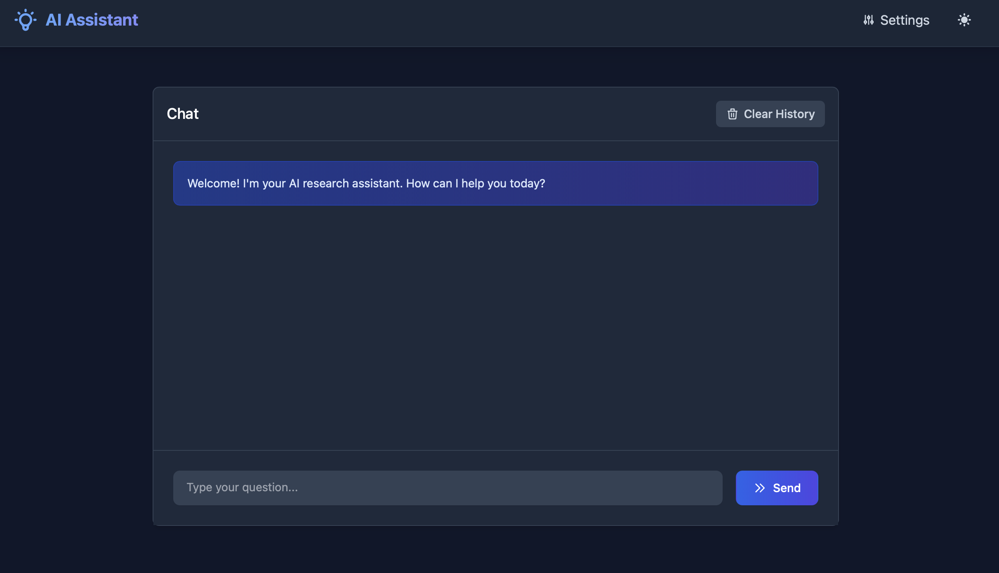
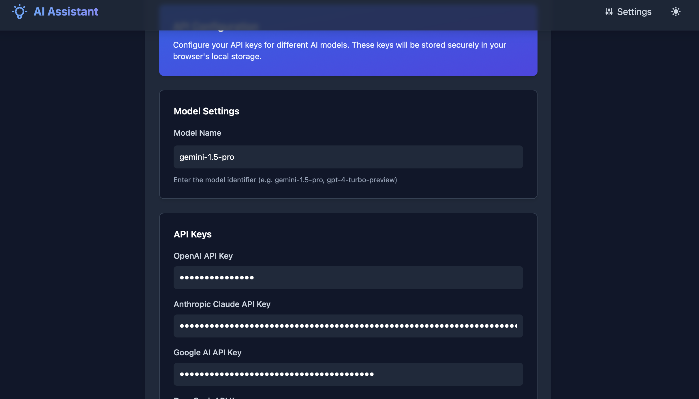

# AI Assistant

[](https://astro.build)
[](https://www.typescriptlang.org/)
[](https://tailwindcss.com)
[](https://hub.docker.com/r/xhh1128/astro-ai)
[](https://vercel.com)
[](https://opensource.org/licenses/MIT)
<!-- [](https://hub.docker.com/r/xhh1128/astro-ai) -->

An AI-powered assistant built with Astro and multiple language model integrations.

[](https://vercel.com/new/clone?repository-url=https%3A%2F%2Fgithub.com%2Fwanghui5801%2FAstro-Ai&env=PUBLIC_OPENAI_API_KEY,PUBLIC_ANTHROPIC_API_KEY,PUBLIC_GOOGLE_API_KEY,PUBLIC_DEEPSEEK_API_KEY,PUBLIC_DEFAULT_MODEL,PUBLIC_SHOW_SETTINGS&project-name=ai-assistant&repository-name=ai-assistant)

## 🚀 Screenshots

<div align="center">
  
  
</div>

## 🚀 Features

- 🤖 Multi-model support (GPT, Claude, Gemini, DeepSeek)
- 🌓 Dark/Light theme
- ✨ Markdown & LaTeX support
- 💾 Chat history with local storage
- 📱 Responsive design

## 🛠️ Environment Variables

Before deploying, make sure to configure these environment variables:

```env
PUBLIC_OPENAI_API_KEY=     # Your OpenAI API key
PUBLIC_ANTHROPIC_API_KEY=  # Your Anthropic API key
PUBLIC_GOOGLE_API_KEY=     # Your Google API key
PUBLIC_DEEPSEEK_API_KEY=   # Your DeepSeek API key
PUBLIC_DEFAULT_MODEL=      # Default model (e.g., "gpt-3.5-turbo")
PUBLIC_SHOW_SETTINGS=      # Show settings page ("true" or "false")
```

## 🚀 Quick Start

1. Clone the repository
2. Install dependencies:
```bash
npm install
```
3. Create a `.env` file with the required environment variables
4. Start the development server:
```bash
npm run dev
```

## 🧞 Commands

All commands are run from the root of the project, from a terminal:

| Command                   | Action                                           |
| :------------------------ | :----------------------------------------------- |
| `npm install`             | Installs dependencies                            |
| `npm run dev`             | Starts local dev server at `localhost:4321`      |
| `npm run build`           | Build your production site to `./dist/`          |
| `npm run preview`         | Preview your build locally, before deploying     |

## 🔑 API Keys Setup

Visit the following sites to obtain your API keys:
- 🔵 OpenAI: https://platform.openai.com/account/api-keys
- 🟣 Anthropic: https://console.anthropic.com/
- 🟡 Google AI: https://aistudio.google.com/app/apikey
- 🟢 DeepSeek: https://platform.deepseek.com/

## 📄 Deploy with Docker

[](https://hub.docker.com/r/xhh1128/astro-ai)

1. Pull the Docker image:
```bash
docker pull xhh1128/astro-ai:latest
```

2. Create `.env` file with your API keys:
```env
PUBLIC_OPENAI_API_KEY=your-openai-key
PUBLIC_ANTHROPIC_API_KEY=your-anthropic-key
PUBLIC_GOOGLE_API_KEY=your-google-key
PUBLIC_DEEPSEEK_API_KEY=your-deepseek-key
PUBLIC_DEFAULT_MODEL=gpt-4-turbo-preview
PUBLIC_SHOW_SETTINGS=true
```

3. Run with Docker:
```bash
docker run -d \
  --name ai-assistant \
  -p 4321:4321 \
  --env-file .env \
  xhh1128/astro-ai:latest
```

Or use Docker Compose:

Create `docker-compose.yml`:
```yaml
version: '3.8'

services:
  ai-assistant:
    image: xhh1128/astro-ai:latest
    ports:
      - "4321:4321"
    environment:
      - PUBLIC_OPENAI_API_KEY=${PUBLIC_OPENAI_API_KEY}
      - PUBLIC_ANTHROPIC_API_KEY=${PUBLIC_ANTHROPIC_API_KEY}
      - PUBLIC_GOOGLE_API_KEY=${PUBLIC_GOOGLE_API_KEY}
      - PUBLIC_DEEPSEEK_API_KEY=${PUBLIC_DEEPSEEK_API_KEY}
      - PUBLIC_DEFAULT_MODEL=${PUBLIC_DEFAULT_MODEL}
      - PUBLIC_SHOW_SETTINGS=${PUBLIC_SHOW_SETTINGS}
    restart: unless-stopped
```

Then run:
```bash
docker-compose up -d
```

4. Access the application at `http://localhost:4321`

## 📄 Deploy on Vercel

1. Fork this repository
2. Click the "Deploy with Vercel" button above
3. Configure the required environment variables in Vercel:
   - PUBLIC_OPENAI_API_KEY
   - PUBLIC_ANTHROPIC_API_KEY
   - PUBLIC_GOOGLE_API_KEY
   - PUBLIC_DEEPSEEK_API_KEY
   - PUBLIC_DEFAULT_MODEL
   - PUBLIC_SHOW_SETTINGS
4. Deploy and enjoy! 🎉

## 📝 Notes

- ⚠️ Make sure to set up all required API keys in your environment variables
- ⚙️ The settings page can be enabled/disabled using `PUBLIC_SHOW_SETTINGS`
- 💾 Chat history is stored in localStorage

## 📄 License

MIT License